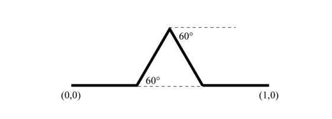

Design of Koch-Dipole Antenna Using CST
Abstract :
In  this  report,  a  simple  first iteration of the Koch fractal dipole  antenna  has  been designed  and  analysed  for  wireless  applications.  Resonant frequency  for  the  dipole  antenna  was  1800 MHz  and  as  a simulation  tool  CST  Microwave  Studio   has  been used. After that the return loss curve, the VSWR and the far-field radiation patterns  of the  Koch dipole  antenna have been observed. 

Index Terms—Dipole Antenna, S-Parameter, Gain, Directivity and CST studio.

INTRODUCTION:
A Koch-Dipole antenna is a simple antenna that normally consists of two metal rods, a terminal block and coaxial cable. The Koch Snowflake was created by the Swedish mathematician Niels Fabian Helge von Koch. In order to create the Koch Snowflake, von Koch began with the development of the Koch Curve. The Koch Curve starts with a straight line that is divided up into three equal parts. Using the middle segment as a base, an equilateral triangle is created. Finally, the base of the triangle is removed, leaving us with the first iteration of the Koch Curve.

ANTENNA DESIGN PARAMETERS :
The basic structure of Koch dipole antenna is shown in the figure. A port is provided at the centre of the dipole and is fed by a voltage source. The proposed antenna is designed at a resonant frequency of 1800 MHz the antenna design parameters at 1800 MHz is given by:
RESULT ANALYSIS:
The proposed koch Dipole is simulated in CST Microwave studio. The optimized antenna design parameters have achieved improved gain and directivity.
CONCLUSION :
     Main  objective  of  this  report  was  to  observe  the  Koch Dipole antenna characteristics. Obtained results were acceptable for practical implementation of  this  type of  antenna.  As  a  simulation  tool  CST Microwave  Studio  was  used  which  ease  the  simulation. 
     Obtained  resonant  frequency  (1800 MHz)  was  lesser  than target  frequency  (5  GHz)  which  is  acceptable.  Return  loss obtained  as  1.983 dB  which shows  the  characteristic  of Koch Dipole. There are  few scopes to improve  the results by optimizing  several  parameters  which  might  be  fruitful  for researchers. 

